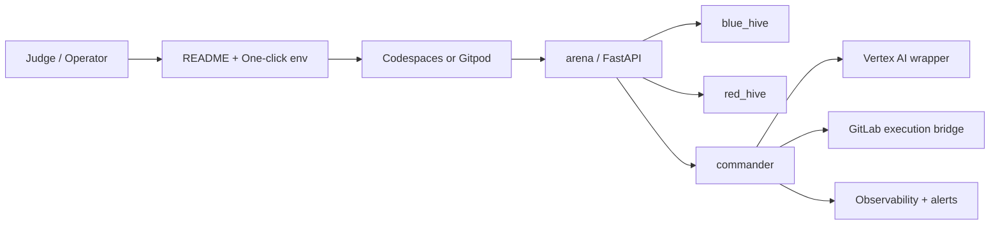

# Aegis_CM_Swarm

[](https://codespaces.new/AAH20/Aegis_CM_Swarm2)
[](https://gitpod.io/#https://github.com/AAH20/Aegis_CM_Swarm2)
[](https://github.com/AAH20/Aegis_CM_Swarm2/actions/workflows/ci.yml)

Aegis_CM_Swarm is a safe, Dockerized multi-service demo scaffold for orchestrating a small agent swarm with raw Vertex AI SDK patterns.

It is designed to show the shape of an agentic system without shipping offensive logic or intentionally vulnerable components. The repository includes:

- a FastAPI service that acts as the arena
- three worker containers that simulate red, blue, and commander roles
- a raw Vertex AI wrapper that can run online or in offline/demo mode
- a small MCP-style tool declaration module
- a live GitLab API execution bridge for real incident creation
- a local demo entrypoint for quick verification

## Why this is investable

This project is more than a demo because it shows the platform qualities buyers expect from a modern DevSecOps and automation product:

- a frictionless developer environment that boots in Docker, Codespaces, or Gitpod
- a clear control plane for orchestration, telemetry, and tool execution
- safe defaults with offline fallback behavior for repeatable demos
- an execution bridge pattern that can connect to real enterprise systems
- a presentation-ready workflow that proves both engineering depth and operator value

## Platform architecture



The architecture is intentionally simple so it is easy to explain in a sales call, but it still demonstrates the core ingredients of a real platform: bootstrapping, control, policy, and operational feedback.

## Project goals

This scaffold is built to demonstrate:

- native Vertex AI usage without LangChain wrappers
- simple containerized orchestration with Docker Compose
- safe telemetry polling between services
- a clean place to map external tool declarations
- a one-click cloud development environment for reviewers and buyers
- platform engineering and DevSecOps workflow signals
- a demo-ready structure that is easy to explain in a presentation

## Buyer value

If you are pitching this to a buyer, frame it around outcomes:

- reduce time to first demo from hours to minutes
- standardize incident workflows across teams
- keep agent-driven automation auditable and controlled
- make cloud and local environments behave the same way
- reduce setup friction that usually blocks adoption

## Enterprise readiness

The strongest enterprise signals in this repo are:

- containerized services with predictable startup behavior
- a hidden `.devcontainer` configuration for browser-based onboarding
- a live execution bridge pattern that can be swapped for real integrations
- structured offline fallback modes for resilience and repeatability
- a clear place to add security gates, approvals, and logging

## Suggested proof points

Add these metrics or screenshots to make the project even more compelling:

- time to boot in Codespaces
- time to first meaningful alert
- number of services launched automatically
- a screenshot of the dashboard fully loaded in the browser
- a short clip showing the GitLab incident creation path

## Validation and trust

The repository now includes a GitHub Actions workflow that installs dependencies and compiles the Python sources on every push and pull request.

That gives reviewers a fast confidence signal that the repo is maintained like a real product and that the code path is continuously checked before changes land.

## Repository layout

```text
Aegis_CM_Swarm/
├── arena/
│   ├── Dockerfile
│   ├── main.py
│   └── requirements.txt
├── blue_hive/
│   ├── Dockerfile
│   ├── app.py
│   └── requirements.txt
├── commander/
│   ├── Dockerfile
│   ├── app.py
│   └── requirements.txt
├── core/
│   ├── agent.py
│   └── mcp_bridge.py
├── red_hive/
│   ├── Dockerfile
│   ├── app.py
│   └── requirements.txt
├── demo.py
├── docker-compose.yml
├── .env.example
├── requirements.txt
├── scripts/
│   ├── elevenlabs_demo.py
│   └── vertex_smoke_test.py
└── README.md
```

## Services

### `target_arena`

The arena is a secure FastAPI app exposed on port `8000`.

It provides:

- `GET /` for a simple service banner
- `GET /health` for a health check
- `GET /api/data` for sample records
- `GET /metrics` for deterministic demo telemetry

The `/metrics` endpoint is intentionally synthetic so the workers can demonstrate a monitoring loop without requiring real infrastructure access.

### `red_hive`

The red hive is a safe probe worker.

It:

- polls the arena health endpoint
- fetches the sample payload records
- reads synthetic metrics from `/metrics`
- prints a short summary every few seconds

This role is useful for showing a scanning or probing workflow in the demo without performing any unsafe actions.

### `blue_hive`

The blue hive is the baseline and telemetry worker.

It:

- samples the arena health endpoint
- captures deterministic CPU, memory, and request-rate metrics
- prints a stable baseline report

This role is meant to represent the defensive or observability side of the workflow.

### `commander`

The commander is the coordination worker.

It:

- queries the arena health and metrics endpoints
- summarizes the current arena state
- prints a lightweight orchestration report

This role represents the layer that would normally decide what to do next in a real swarm.

## Core modules

### `core/agent.py`

Contains `AegisSwarmNode`, a raw Vertex AI wrapper that:

- initializes Vertex AI when cloud configuration is available
- starts a generative chat session
- accepts telemetry strings
- handles function-call responses from the model
- falls back to an offline chat stub when cloud access is not available

The offline fallback is what makes `demo.py` work locally without a Google Cloud project or model access.

### `core/mcp_bridge.py`

Defines raw Vertex `FunctionDeclaration` objects for the partner demo tools:

- `dynatrace_anomaly_detect`
- `elastic_siem_publish`
- `fivetran_sync_baseline`
- `mongodb_store_threat_intel`
- `gitlab_create_incident`
- `arize_log_agent_reasoning`
- `generate_caldera_profile`

These are declarations only; they are intended as integration points for future tool execution layers.

### `core/executor.py`

Contains the live GitLab execution bridge used by the commander when a real token and project ID are provided.

## Requirements

### Local development

- Python 3.11 or newer is recommended for running the services locally
- Docker and Docker Compose are required for the multi-container demo
- The repository already includes a workspace virtual environment under `.venv/`

### Optional cloud usage

If you want to use the online Vertex AI path in `core/agent.py`, you need:

- a Google Cloud project
- the Vertex AI API enabled
- credentials available to the workspace environment

If those are not available, the offline mode still lets you run the full local demo.

### Environment template

Copy [.env.example](.env.example) to a local `.env` file if you want a single place to manage the demo variables:

```bash
cp .env.example .env
```

Then edit the values that apply to your local setup.

### Google Cloud setup

To authenticate locally for Vertex AI, run:

```bash
gcloud auth login
gcloud auth application-default login
gcloud config set project YOUR_PROJECT_ID
gcloud services enable aiplatform.googleapis.com
```

Then set the runtime variables before using the online demo path:

```bash
export GOOGLE_CLOUD_PROJECT="YOUR_PROJECT_ID"
export VERTEX_AI_LOCATION="us-central1"
export AEGIS_OFFLINE=0
make demo-online
```

### Vertex AI environment variables

- `GOOGLE_CLOUD_PROJECT`: Google Cloud project ID used by Vertex AI
- `VERTEX_AI_LOCATION`: Vertex AI region, for example `us-central1`
- `GOOGLE_CLOUD_LOCATION`: alternate location variable accepted by the agent helper
- `AEGIS_OFFLINE`: set to `0`, `false`, or `no` to prefer the online Vertex path when credentials are present

When `GOOGLE_CLOUD_PROJECT` is set and `AEGIS_OFFLINE` is disabled, `demo.py` will use the real Vertex AI SDK path instead of the offline stub.

## Quick start with Docker

From the repository root:

```bash
docker compose up --build
```

After startup:

- the arena is available at `http://localhost:8000`
- the worker containers begin polling the arena automatically
- the logs will show the safe orchestration loop in action

To stop the stack:

```bash
docker compose down
```

### Shortcut commands

The repository includes a `Makefile` with a few convenience targets:

```bash
make up          # build and start the full Docker stack
make down        # stop the Docker stack
make build       # build images without starting them
make demo        # run the offline Vertex demo
make demo-online # run the Vertex demo with cloud credentials enabled
make elevenlabs  # generate the local ElevenLabs MP3
make arena       # run the FastAPI arena locally without Docker
```

The same actions are also available in VS Code under the Task Runner as:

- `Aegis: Docker Up`
- `Aegis: Docker Down`
- `Aegis: Offline Demo`
- `Aegis: Online Demo`
- `Aegis: ElevenLabs Demo`
- `Aegis: Run Arena`

### VS Code debugging

The repository also includes launch configs for quick debugging in VS Code:

- `Aegis: Debug Offline Demo`
- `Aegis: Debug Online Demo`
- `Aegis: Debug Arena`
- `Aegis: Debug ElevenLabs Demo`

## Vertex smoke test

If you want a tiny end-to-end check of the raw Vertex wrapper without running the full stack, use:

```bash
python scripts/vertex_smoke_test.py
```

The script sends a short synthetic telemetry payload through `AegisSwarmNode` and works in either offline or online mode depending on your environment.

## Local demo without Docker

If you only want to exercise the agent wrapper:

```bash
python demo.py
```

That command uses the offline fallback in `core/agent.py` and prints a sample telemetry response.

To use the online Vertex AI path, set the environment first:

```bash
export GOOGLE_CLOUD_PROJECT="your-gcp-project"
export VERTEX_AI_LOCATION="us-central1"
export AEGIS_OFFLINE=0
python demo.py
```

## Suggested local Python setup

If you want to run the FastAPI service or the demo script directly:

```bash
python -m venv .venv
source .venv/bin/activate
pip install -r requirements.txt
```

Then run the demo script:

```bash
python demo.py
```

Or run the arena directly:

```bash
uvicorn arena.main:app --reload --host 0.0.0.0 --port 8000
```

## Environment variables

### Arena

- `APP_NAME`: service label for the arena container
- `APP_ENV`: demo environment tag
- `ARENA_SEED`: controls the deterministic synthetic metrics

### Workers

- `AGENT_ROLE`: displayed role name for each worker
- `ARSENAL_MODE`: worker mode label used by `red_hive`
- `MONITOR_TARGET`: logical target name used by `blue_hive`
- `COMMAND_MODE`: commander mode label
- `TARGET_BASE_URL`: arena URL used by all worker containers

### Commander alerts

- `COMMANDER_CPU_ALERT_THRESHOLD`: CPU percentage that triggers the voice-alert path
- `COMMANDER_ALERT_PHONE_NUMBER`: destination phone number used in the alert payload

## ElevenLabs voice demo

The repository includes a safe text-to-speech helper at `scripts/elevenlabs_demo.py`.

It generates an MP3 file locally using the ElevenLabs API and writes it to `artifacts/elevenlabs_alert.mp3` by default.

Example:

```bash
export ELEVENLABS_API_KEY="your-key"
export ELEVENLABS_VOICE_ID="your-voice-id"
export ELEVENLABS_TEXT="Aegis Commander alert. Please review the telemetry."
python scripts/elevenlabs_demo.py
```

Optional variables:

- `ELEVENLABS_MODEL_ID`: ElevenLabs model name, defaults to `eleven_multilingual_v2`
- `ELEVENLABS_OUTPUT_PATH`: output file path for the generated MP3

## Commander orchestration

The commander container now performs a full demo loop:

1. fetches `/health` and `/metrics` from the arena
2. serializes the telemetry and passes it through `AegisSwarmNode`
3. prints the agent response
4. checks the reported CPU against `COMMANDER_CPU_ALERT_THRESHOLD`
5. generates a MITRE Caldera profile locally
6. opens a real GitLab incident when credentials are configured

This keeps the demo safe while still showing the control flow judges usually want to see.

### Partner API execution

Aegis Swarm uses a pluggable execution architecture. The GitLab track is wired to a live API bridge that takes Gemini 2.5 Pro tool output and creates issues in a real GitLab repository when `GITLAB_TOKEN` and `GITLAB_PROJECT_ID` are configured. The remaining partner integrations run in dry-run mode and emit the exact payloads needed for future real API connections.

## Files you are most likely to edit

- [arena/main.py](arena/main.py) to adjust the demo API shape
- [core/agent.py](core/agent.py) to connect real Vertex AI behavior
- [core/mcp_bridge.py](core/mcp_bridge.py) to add or rename tools
- [docker-compose.yml](docker-compose.yml) to change service wiring
- [demo.py](demo.py) to extend the local offline example
- [.env.example](.env.example) to tune the default environment values
- [scripts/vertex_smoke_test.py](scripts/vertex_smoke_test.py) for a quick Vertex verification run

## Demo flow

The current demo flow is intentionally simple:

1. `target_arena` starts and serves health, data, and metrics endpoints.
2. `red_hive` polls the arena and prints a safe probe summary.
3. `blue_hive` establishes a baseline from the arena telemetry.
4. `commander` reads the same telemetry, sends it through the agent wrapper, and emits a voice-alert path when CPU is above threshold.
5. `demo.py` shows how telemetry is passed into the raw Vertex wrapper in offline or online mode.
6. `scripts/elevenlabs_demo.py` generates a local audio file for the pitch.

This gives you a full end-to-end narrative for a hackathon demo without requiring any risky behavior.

## What the demo does not do

To keep the scaffold safe and presentation-friendly, it does not include:

- exploit generation
- attack execution
- intentionally vulnerable endpoints
- destructive remediation logic

If you want a realistic security story, you can still talk about detection, telemetry, orchestration, and automated response patterns using the existing safe services.

## Troubleshooting

### Docker build issues

If a container fails to build, make sure Docker Desktop is running and retry:

```bash
docker compose up --build
```

### Python import issues

If `vertexai` imports fail in your local shell, activate the workspace environment first or reinstall dependencies:

```bash
source .venv/bin/activate
pip install -r requirements.txt
```

### Port conflicts

If port `8000` is already in use, stop the process using it or change the mapped port in `docker-compose.yml`.

## Extending the scaffold

Common next steps include:

- connecting `core/agent.py` to a real Google Cloud project
- adding a message queue or stream between workers
- replacing the synthetic metrics endpoint with a real collector
- adding tests around the FastAPI app and the local demo script
- building a UI dashboard for orchestration status

## License

No license has been added yet. Add one if you plan to share or publish the project.
